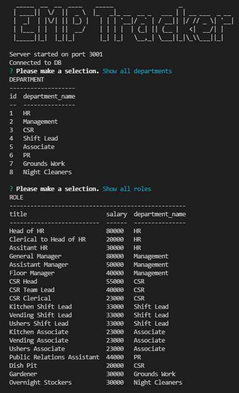

# Emp-Tracker

## License

## Table of Contents

 * [Installation](#installation)
 * [Usage](#usage)
 * [Credits](#credits)
 * [License](#license)
 
## Description

<a href="https://drive.google.com/file/d/1xtqA-Q_CJNxJnZgpmMN5_v9RH5D2EvJQ/view" target="_blank">CLICK TO VIEW THE PROGRAM WORKING</a>

<a href="https://drive.google.com/file/d/1xtqA-Q_CJNxJnZgpmMN5_v9RH5D2EvJQ/view" target="_blank">CLICK TO VIEW THE PROGRAM WORKING</a>

It helps keep track of employee's name, salary, job title, and manager in charge of them

## Usage

Type node index in command prompt from the root directory

## Installation

>npm i inquirer mysql2 console.table

## Languages

JavaScript ,Node 

## Questions

### AdamR-Work

https://github.com/AdamR-Work/emp-tracker

## Contributing

## Tests

>no

## Credits

